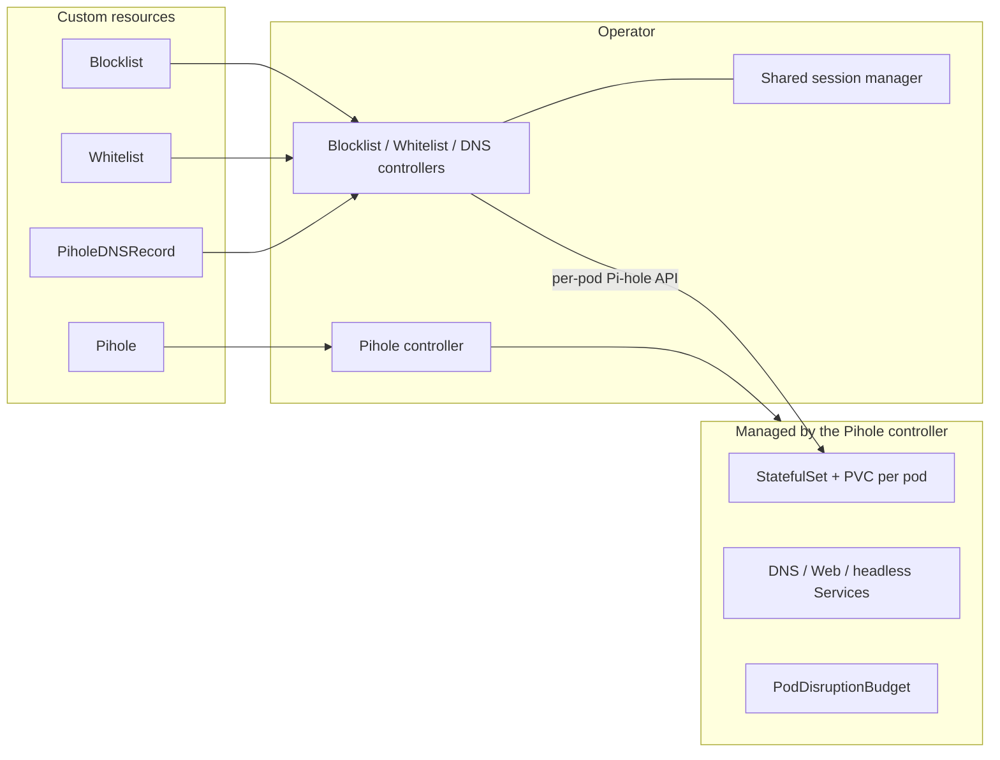

# Design

This page explains how the operator is put together and the reasoning behind the main decisions.

## Overview

There are two kinds of controller:

- The **Pihole controller** owns the infrastructure: it turns a `Pihole` into Kubernetes objects.
- The **configuration controllers** (Blocklist, Whitelist, PiholeDNSRecord) own nothing in Kubernetes. They push desired state into running Pi-hole pods through Pi-hole's HTTP API.

## The Pihole controller

For each `Pihole` the controller reconciles:

| Object | Purpose |
|---|---|
| Secret | Admin password (generated, inline, or referenced from an existing Secret) |
| DNS Service | Port 53, type configurable (`NodePort` by default) |
| Web Service | The web UI and API, routed to a single Ready pod (see below) |
| Headless Service | `<name>-headless`, gives each pod a stable DNS name |
| StatefulSet | The Pi-hole pods, with a `volumeClaimTemplate` for `/etc/pihole` |
| PodDisruptionBudget | Created when `size > 1` with `minAvailable: 1` |
| Ingress | Optional; deleted again if disabled |

It also handles drift: if Service settings such as type or load balancer IP change on the `Pihole`, the existing Service is updated on the next reconcile, with no manual deletion needed. Status (`readyReplicas`, `dnsIP`, `webURL`) and best-effort statistics from pod 0 are written back to the resource.

### Web Service failover

Pi-hole stores web sessions in memory per pod, so the web Service selects exactly one pod via `statefulset.kubernetes.io/pod-name`. Service `sessionAffinity: ClientIP` is not enough: gateways and ingress controllers usually send traffic straight to pod endpoints, bypassing kube-proxy, and even when they don't, the client IP kube-proxy sees is the proxy's rather than the user's.

The controller watches its pods (the cache is limited to operator-managed pods) and reconciles when one's readiness changes. It keeps the current pod while it is Ready and otherwise moves to the lowest-ordinal Ready pod. If no pod is Ready, the selector is left unchanged.

### Why a StatefulSet

Pi-hole keeps its state (gravity database, settings) on local disk, and every replica is independent. Two consequences follow:

1. Each replica needs its **own volume**, which is what `volumeClaimTemplates` provides. Sharing one PVC between replicas would not work.
2. Each replica needs a **stable, addressable identity**, because configuration has to be pushed to every one individually. The headless Service gives every pod a predictable name: `<name>-<ordinal>.<name>-headless.<namespace>.svc`.

## Configuration sync

Pi-hole has no built-in clustering, so the operator acts as the source of truth. Each configuration controller:

1. Finds the target `Pihole` instances, in the resource's own namespace by default, or in `targetNamespaces` (a list, or `"*"` for the whole cluster).
2. Talks to **each pod** of each Pihole (not to the load-balanced Service, which would hit an arbitrary replica).
3. Compares what exists in Pi-hole with what the resource asks for, then adds or removes only the difference.
4. Reports the result in the resource's status conditions and resyncs periodically to correct drift.

A finalizer on each resource makes sure the entries it created are removed from Pi-hole when the resource is deleted.

## API sessions

Pi-hole v6 authenticates API calls with a session ID (SID) and allows only a limited number of concurrent sessions. Authenticating on every reconcile would quickly exhaust them, so the operator manages sessions centrally:

- **Shared cache.** One session manager, keyed per pod, is shared by all controllers, so a pod is authenticated once and the SID reused (8 minute lifetime).
- **Backoff.** Failed authentication is throttled with exponential backoff (1s up to 30s) so a wrong password cannot turn into a login storm.
- **Retry on expiry.** In the Pihole and Blocklist controllers, a `401`/`403` invalidates the cached SID and retries the call once with a fresh session. The Whitelist and PiholeDNSRecord controllers rely on the next reconcile instead.
- **Connection reuse.** HTTP clients are cached per pod rather than created per request.

## Security

- **TLS.** Pi-hole ships a self-signed certificate, so certificate verification is off by default. `spec.tls` turns it on, optionally with a private CA. `spec.serverTLS` lets Pi-hole serve your own certificate. See [TLS](tls.md).
- **Outbound request guard.** Every call the operator makes to a Pi-hole goes through a validator that only allows `http`/`https` and rejects loopback, link-local, multicast and unspecified addresses, as a baseline defence against SSRF.
- **Least privilege.** RBAC is generated from `kubebuilder` markers, so the ClusterRole matches what the controllers actually do.

## Testing

| Level | What it covers | How |
|---|---|---|
| Unit / controller | Reconcile logic for all four controllers, including auth failures, deletion and cross-namespace targeting | Go tests against [envtest](https://book.kubebuilder.io/reference/envtest.html), with an in-process mock Pi-hole API (`httptest`) |
| End to end | The operator running in a real cluster | [kind](https://kind.sigs.k8s.io/), on every pull request |
| Chart | The Helm chart installs cleanly | kind, on every pull request |
| Security | Known vulnerabilities and static analysis | `govulncheck`, `gosec` and Trivy, on a schedule and on pull requests |
